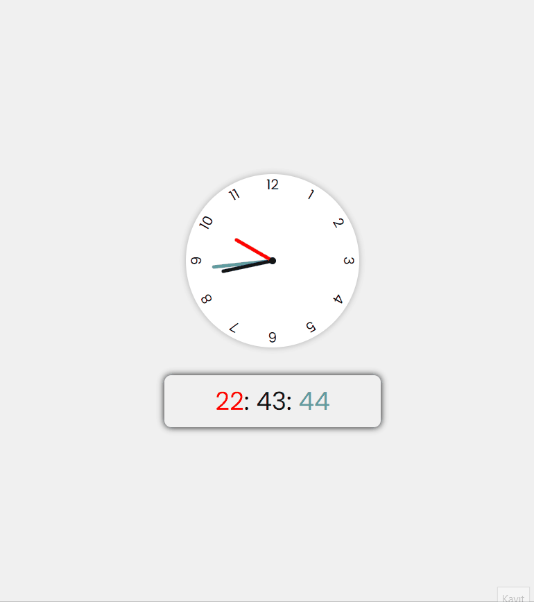

# Analog-Digital-Clock

## Table of contents

  - [Project Skeleton ](#project-skeleton)
  - [Screenshot](#screenshot) 
  - [Links](#links)
  - [Built with](#built-with)
  - [Useful resources](#useful-resources)
  - [Author](#author)

## Project Skeleton 

Analog-Digital-Clock(folder)

|----README.md                   
|----index.html
|----style.css
|----app.js

## Screenshot

## Links

<b>Check The Live Website ➡️</b> <a href="https://asfiyanur.github.io/Analog-Digital-Clock/">Live Website</a>

### Built with

- JS DOM Manipulation
- Semantic HTML5 markup
- CSS custom properties
- Flexbox
- CSS transform property
- CSS custom properties (variables)
- css z-index property

- CSS Colors-Border Properties
- CSS Margins-Padding
- CSS Properties for Texts-Font Families-Links

-

## Notes

- You can use HTML,and CSS, JS  to complete this project.

### Useful resources

- [W3 Schools](https://www.w3schools.com/) -This is an amazing document which helped me to understand transform and variables in css.
 

## Author

- Author - [Asfiyanur]

 &#8987; Happy Coding  &#9997; 

